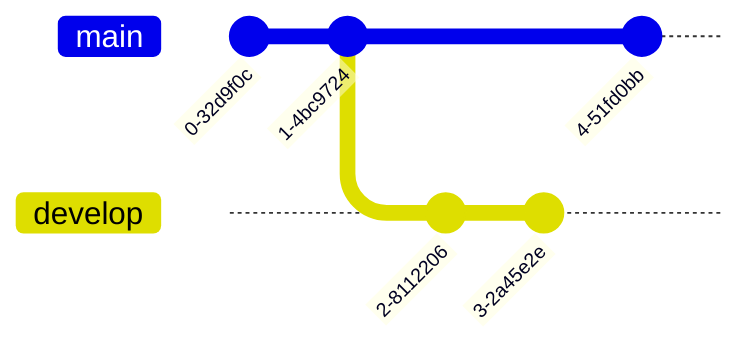

# mermaid-autoloader.js
Generate mermaid from text with scaling support


1. In your html add(use index.html & mermaid-autoloader.js)
```
<div class="mermaid"></div>
<script src="./mermaid-autoloader.js"></script>>
```
3. You need to put the address of the text you want to import after the link
4. Writing mermaid syntax in your markdown, like ```test.md```

```



5. Open [https://rcqed.github.io/mermaid-autoloader.js/index.html?path=test.md](https://rcqed.github.io/mermaid-autoloader.js/index.html?path=./test.md) to see that

lite: If you only want to add zoom and drag functionality, you can use the ```move&zoom.html```,[https://rcqed.github.io/mermaid-autoloader.js/move&zoom.html](https://rcqed.github.io/mermaid-autoloader.js/move&zoom.html)

## thanks for [mermaid](https://github.com/mermaid-js/mermaid)!!!
